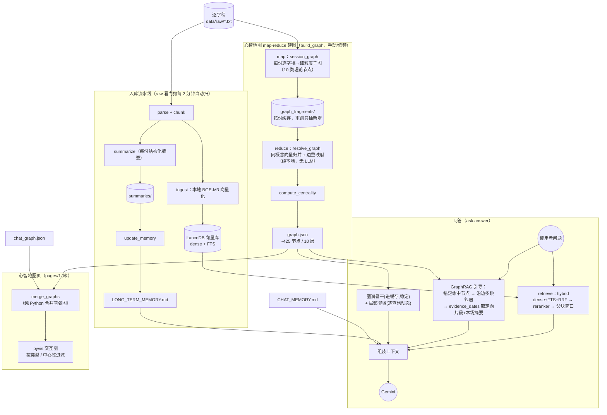

# 个人 AI 心理咨询系统 —— 运维手册

详细的架构设计见 [PROJECT_SPEC.md](PROJECT_SPEC.md)。这份文件只讲"怎么启动/怎么维护"。

## 〇、架构总览（先有张图心里有底）

四条数据流：**入库**（逐字稿 → 向量库 + 摘要 + 长期记忆）、**建图**（逐字稿 →
map-reduce 心智地图）、**问答**（问题 → 混合检索 + GraphRAG 引导 → LLM）、**可视化**（两张图合并渲染）。
只有调 LLM 出网，索引 / 向量化 / 归并 / 精排都在本机跑。

> **LLM 后端可切换**（见 §七「LLM 后端 provider」）：默认 **Gemini**；也可切到 **Grok**（xAI 直连）
> 或 **Hermes**（本地 Agent Gateway 代理，转发到 xAI grok）。下文和图里凡写「Gemini」处，除
> Explicit Cache（Gemini 专有，切走后自动退回内联）外都同样适用于当前选中的后端。



**心智地图这条链是本项目的 GraphRAG 核心**（详见 §四）：不是把整张几百节点的图塞给
Gemini，而是「稳定骨干进缓存 + 命中问题的局部邻域动态拼入」，并沿关系边多跳、按证据日期
在那天内取定向片段 + 本场结构化摘要（不再整份逐字稿，省 token 又不丢来龙去脉）。

**Context 自动压缩机制**（保持长对话稳定在 500K 以内）：历史对话默认只保留"检索片段 + 问题"，
不重复发送静态内容（长期记忆/心智地图骨干）；当累积 context 超过 450K 时自动两阶段压缩：
- 阶段 1（免费）：最旧的用户消息丢弃检索片段，只保留原始问题（每轮省 10K）
- 阶段 2（调用 LLM）：如仍超限，压缩最长的 assistant 回答（智能摘要，每轮省 3-6K）
压缩时会显示透明提示；侧边栏可开启"深度模式"恢复完整历史。正常使用（60 轮内）不会触发
阶段 2，长对话时每 20-30 轮约消耗 1 美元 LLM 压缩成本。详见 §七「Context 压缩策略」。

## 一、日常使用：服务已经自动启动

四个服务都设置成 **登入 Mac 时自动启动、意外退出自动重启**（用 macOS launchd 管理），
正常情况下你什么都不用做，直接打开下面的网址用就行：

- 本机浏览器：http://localhost:8501
- 手机/其他设备（需要该设备也登入同一个 Tailscale 账号并保持连接）：http://100.64.84.111:8501
  （这个地址已经存在 macOS 备忘录「心理咨询AI助手 - 访问地址」里）

侧边栏第二页是「心智地图」，可视化核心图式/应对模式/事件的关系图。

### 一键开/关（终端别名）

已在 `~/.zshrc` 配好三个别名（新开终端即可用；服务本来就开机自启，这几个是需要手动
临时关掉/重开时用的）：

```bash
start-counseling-agent    # 启动网页 + 聊天记忆看门狗 + raw 入库看门狗（并确保 Tailscale 在线）
stop-counseling-agent     # 停掉网页 + 两个看门狗（保留 Tailscale，因为它是全局私网）
status-counseling-agent   # 查看四个服务状态 + 健康检查 + Tailscale 私网地址
```

底层是 [scripts/counseling_agent_ctl.sh](scripts/counseling_agent_ctl.sh)（`start|stop|restart|status`），
别名只是 `bash <该脚本> <命令>` 的薄封装。注意 `stop` **不会**断开 Tailscale——它是你整台
机器的私网，别的设备/服务也在用；真要断网另跑 `tailscale down`。

## 二、检查服务是不是正常运行

```bash
status-counseling-agent            # 最省事：一条命令看全部（别名）

# 或手动逐项查：
launchctl list | grep aitherapist  # 四个服务状态（第二列 exit code，0 = 正常）
curl -s http://localhost:8501/_stcore/health   # Streamlit 健康检查，应输出 ok
tailscale status                   # Tailscale 连接状态
```

## 三、如果服务没起来（比如刚装完 launchd，或怀疑哪里坏了）

### 改了代码要不要重启？大多数情况：不用

已开启 Streamlit 热重载（`.streamlit/config.toml` 里的 `runOnSave = true` + `watchdog` 事件监控）：
**改了本项目的 `.py`（`app.py` / `pages/` / `scripts/` / `config.py`）存盘后，跑着的服务会自动重跑并
重新 import 变更的模块**，下一次交互即生效，不用手动重启。历史上多次踩的坑（改了 `scripts/` 里的
模块但跑着的进程还用旧代码），就是因为 Streamlit 每次 rerun 只重新执行 `app.py`，而 import 进来的
模块缓存在 `sys.modules` 里——现在交给热重载自动处理了。（原理和「什么时候仍要重启」见下方注 ⭐）

> ⭐ **仍需手动重启**的少数情况：① 改了 `.streamlit/config.toml` 本身；② 给某模块**新增了顶层
> import**（偶尔热重载捕捉不到）；③ 想强制重载已进内存的大模型（换了 embedding / reranker 的
> model / device / fp16——这些是进程内单例，见 §七）。这几种最省事、最可靠的一条命令是：
>
> ```bash
> bash scripts/counseling_agent_ctl.sh restart   # = stop; sleep 2; start，一条搞定
> ```
>
> ⚠️ 别再手动敲 `launchctl bootout` 紧接着 `bootstrap`——`bootout` 是异步的，紧跟着 `bootstrap`
> 有概率撞上 `Bootstrap failed: 5: Input/output error`（服务还没完全卸载）。上面的 `restart`
> 子命令内置了 `sleep 2` 间隔并对「已加载」用 `kickstart`，不会踩这个race。

### 手动重启单个服务（一般用上面的 `restart` 就够，这里是逐服务的等价写法）

```bash
cd "/Users/andytsang/Documents/Project/心理咨詢agent"

# 重启 Streamlit（bootout 后留一点时间再 bootstrap，避开上面说的 I/O error race）
launchctl bootout gui/$(id -u)/com.andytsang.aitherapist.streamlit 2>/dev/null; sleep 2
launchctl bootstrap gui/$(id -u) ~/Library/LaunchAgents/com.andytsang.aitherapist.streamlit.plist

# 重启聊天记忆看门狗
launchctl bootout gui/$(id -u)/com.andytsang.aitherapist.chatmemorywatcher 2>/dev/null; sleep 2
launchctl bootstrap gui/$(id -u) ~/Library/LaunchAgents/com.andytsang.aitherapist.chatmemorywatcher.plist

# 重启 raw 逐字稿入库看门狗
launchctl bootout gui/$(id -u)/com.andytsang.aitherapist.rawingestwatcher 2>/dev/null; sleep 2
launchctl bootstrap gui/$(id -u) ~/Library/LaunchAgents/com.andytsang.aitherapist.rawingestwatcher.plist

# 重新连接 Tailscale
launchctl bootout gui/$(id -u)/com.andytsang.aitherapist.tailscale 2>/dev/null; sleep 2
launchctl bootstrap gui/$(id -u) ~/Library/LaunchAgents/com.andytsang.aitherapist.tailscale.plist
```

### 查看日志排查问题

```bash
cat /tmp/streamlit.log
cat /tmp/chat_memory_watcher.log
cat /tmp/raw_ingest_watcher.log
cat /tmp/aitherapist_tailscale.log
```

### 如果 launchd 配置本身坏了/需要重装

`scripts/launchd/` 目录下是四份 plist 源文件（和 `~/Library/LaunchAgents/` 里生效的那份保持同步）：

```bash
cp "/Users/andytsang/Documents/Project/心理咨詢agent/scripts/launchd/"*.plist ~/Library/LaunchAgents/
for label in com.andytsang.aitherapist.tailscale com.andytsang.aitherapist.streamlit com.andytsang.aitherapist.chatmemorywatcher com.andytsang.aitherapist.rawingestwatcher; do
  launchctl bootout "gui/$(id -u)/$label" 2>/dev/null
  launchctl bootstrap "gui/$(id -u)" ~/Library/LaunchAgents/$label.plist
done
```

⚠️ **已知的坑**：这个项目目录在 `~/Documents` 底下。如果哪天改 launchd 配置时又遇到
`Operation not permitted`，几乎可以确定是同一个坑——**launchd 不能直接 exec 这个目录树下的
脚本文件**（不管是 shell script 还是带 shebang 的可执行文件），但可以：
1. 直接 exec 一个"外部"的解释器二进制、用 `-m 模块名` 加载代码（`python3 -m streamlit`
   而不是 `.venv/bin/streamlit`），或
2. 把命令内联进 `bash -c "命令"`，不要让 launchd 直接 exec 这个目录下的 `.sh` 文件。

当前四份 plist 已经是照这个方式写的，正常不需要再碰。如果想彻底避免这类坑，也可以考虑把
整个项目挪到 `~/Documents` 之外（比如 `~/Projects`），launchd/沙盒类工具对那些路径通常不设限。

### 完全手动跑（不经过 launchd，纯前台调试用）

```bash
cd "/Users/andytsang/Documents/Project/心理咨詢agent"
source .venv/bin/activate
streamlit run app.py --server.port 8501       # Ctrl+C 结束
python -m scripts.chat_memory_watcher          # 另开一个终端跑
```

## 四、维护类命令（不是每天要跑，按需执行）

```bash
cd "/Users/andytsang/Documents/Project/心理咨詢agent"
source .venv/bin/activate

# 有新的一周咨询逐字稿时：直接把 .txt 丢进 private.nosync/data/raw/ 即可——「raw 入库看门狗」
# （com.andytsang.aitherapist.rawingestwatcher，见 §一）每 2 分钟扫一次，发现没入库的新文件
# 就自动跑下面这条一条龙 parse→chunk→embed→摘要→更新长期记忆，无需手动敲命令。
# （文件写完 30s 后才处理，避免抓到复制到一半的半个文件；日志在 /tmp/raw_ingest_watcher.log）
# 每次入库/重建/跳过都会自动追加一条「索引变更记录」，可在侧边栏「📚 已索引的咨询记录」里查看
#
# 想立刻手动入库某份、或看门狗因故没跑起来时，仍可手动执行（效果完全一样，看门狗底层就是调它）：
python -m scripts.ingest_new private.nosync/data/raw/新文件.txt

# 手动重新生成长期记忆（汇总全部咨询摘要）
python -m scripts.update_memory

# 重新生成真实咨询心智地图（map-reduce 建图，也可以在心智地图页面点按钮）：
#   · 增量：只对没缓存 fragment 的新逐字稿调 Gemini 抽子图，其余读 graph_fragments/ 缓存 → 便宜
#   · 归并（reduce）是纯本地向量化，不调 LLM。所以只想调「归并松紧」时（改 graph_utils.py 的
#     MERGE_SIM_THRESHOLD：调高=保留更多细节节点，调低=合并更多），重跑本条几乎免费、几秒完成
#   · 全量重抽所有份（贵，53+ 次 Gemini 调用，只有换了抽取 prompt/schema 才需要）：加 --force
python -m scripts.build_graph
# python -m scripts.build_graph --force   # 全量重抽

# 手动重新生成 AI 对话记忆 + 它的心智地图（便宜，只处理聊天记录；聊天记忆看门狗每 30
# 分钟闲置也会自动跑这两个，正常不需要手动跑，也可以在 Streamlit 侧边栏点按钮）
python -m scripts.update_chat_memory
python -m scripts.build_chat_graph

# 全量重建向量库（一般用不到，除非改了分块/FTS 参数、要对全部历史记录重新索引）
# 也可以在侧边栏「⚙️ 索引设置」弹窗底部点「全量重建」按钮，效果一样（都会记一条变更记录）
python -m scripts.ingest
```

**索引跑在哪：全程本地。** 分块是纯 Python，向量化用本地 BGE-M3 模型（跑在 Apple GPU / MPS 上，
见 `config.py` 的 `EMBEDDING_DEVICE`），向量库是本机 LanceDB 文件（`private.nosync/db/`）——
建索引和检索都**不出网**。唯一出网的是问答 / 摘要时调 LLM（默认 Gemini；用 grok 时走 xAI，用 hermes
时走本地代理再转 xAI，见 §七）。侧边栏「📚 已索引的咨询记录」
可以看当前索引了哪些逐字稿（日期 / 片段数 / 是否已生成摘要）+ 最近的变更记录；
「⚙️ 索引设置」可以像「⚙️ Gemini 设置」一样在 UI 里直接调检索 / 分块 / 向量化 / 分词 / Reranker 精排参数
（弹窗顶部还有一张「哪些参数改完需要全量重建」的速查表）。

心智地图页面看到的图，是 `private.nosync/data/graph.json`（真实咨询）和
`private.nosync/data/chat_graph.json`（AI 对话记忆，便宜）合并显示的——合并本身是纯 Python 操作，不会额外调用 Gemini，
后者带虚线边框区分来源，且可能有 `relates_to` 类型的边把两者连起来（比如聊天里提到的
某个模式，其实呼应了真实咨询里已经识别出的某个核心图式）。

**真实咨询图（`graph.json`）是 map-reduce 逐份抽取再归并出来的**（`scripts/build_graph.py` 编排、
`scripts/session_graph.py` 做 map、`scripts/graph_utils.py` 的 `resolve_graph` 做 reduce）：每份逐字稿
**直接读原文**各抽一张细粒度子图，节点按现代心理学理论分 10 层（核心情感需要 / 依附对象 / 早期
不适应图式 / 中间信念 / 图式模式 / 应对防御 / 触发情境 / 自动思维 / 情绪 / 关键事件；理论依据见
`scripts/session_graph.py` 顶部注释），再跨份把「同一概念」按语义相似度归并。粒度远细于旧版一次性
全局抽取（约 425 节点 vs 旧的 33）。节点/关系类型的**单一真相源**在 `scripts/graph_utils.py` 的
`NODE_TYPES` / `RELATION_TYPES`——新增类型只改这一处，问答上下文（`ask.py`）和可视化页会自动跟上。

**这张图不只是给人看，还回喂问答（GraphRAG）**：`scripts/ask.py` 的 `answer()` 里，问题会先
**锚定**到最相关的图式/信念/模式/应对节点，再**沿关系边多跳**把关联的深层概念一并检索，并按命中
节点/边上的 `evidence_dates` 把「关键证据日」的内容拼进上下文。这里刻意**不再整份逐字稿**（一整天
大量无关对话既占 token 又稀释注意力），而是用锚点概念的向量在那天的块里做一次**定向检索**取最相关
的几段，再附上该场的**结构化摘要**（`summaries/` 里预生成的，几百 token 概括整场弧线）——覆盖面反而
更全、成本约 1/3（实测一场 12820 字 → 4602 字）。连接边证据用边两端概念的合并文本去检索，正好印证
这条多跳关系。图太大不能整份塞给 Gemini，所以拆成「**骨干**（中心性最高的根源驱动节点，进 Explicit
Cache，稳定）+ **局部邻域**（命中概念及其 k-hop 邻居，逐查询动态拼入）」。相关阈值/跳数/骨干大小等
常数都在 `ask.py` 顶部（`GRAPH_*`）；证据日的取几天/每天几段/扩多宽/是否附摘要可在 UI 热调（见 §七）。

## 五、从零搭建（换新机器/灾难恢复时用）

```bash
cd "/Users/andytsang/Documents/Project/心理咨詢agent"

# 1. Python 3.11 虚拟环境
python3.11 -m venv .venv
source .venv/bin/activate
pip install -r requirements.txt

# 2. 中文分词词典（LanceDB FTS 用）——lance 自带的下载器指向的 GitHub 路径已失效，
#    需要手动从新路径下载，详细原因见 config.py 里 FTS_BASE_TOKENIZER 旁边的注释
python -m lance.download jieba
curl -s "https://raw.githubusercontent.com/messense/jieba-rs/main/jieba/src/data/dict.txt" \
  -o "$(python -c 'import lance; print(lance.download.LANGUAGE_MODEL_HOME)')/jieba/default/dict.txt"

# 3. 个人数据放在 private.nosync/ 里。先建目录，把 Gemini API key 写进去
#    （这是凭证，已被 .gitignore 排除，别提交进 git——见第九节）：
mkdir -p private.nosync/data
echo "GEMINI_API_KEY=你的key" > private.nosync/.env
#    （用其它 LLM 后端时按需追加：XAI_API_KEY=... 或 HERMES_API_KEY=...；hermes 走本地代理，
#     key 任意，且 base_url 默认 http://127.0.0.1:8645/v1，见 §七「LLM 后端 provider」。
#     provider 选择本身也可以直接在 UI「⚙️ Gemini 设置」里切，无需写进 .env）
#    （务必确认没有设 ANTHROPIC_API_KEY 环境变量，否则 Claude Code 会改走 API 计费而不是
#     Pro 订阅——见 PROJECT_SPEC.md §4.3）

# 4. 把全部咨询逐字稿放进 private.nosync/data/raw/，然后跑一遍完整流水线
python -m scripts.chunk          # 解析+分块，写 private.nosync/data/processed/chunks.jsonl
python -m scripts.ingest         # 向量化+建 LanceDB（private.nosync/db/）
python -m scripts.summarize      # 每份逐字稿生成结构化摘要（较慢，几十份大概跑半小时+）
python -m scripts.update_memory  # 汇总生成 LONG_TERM_MEMORY.md
python -m scripts.build_graph    # map-reduce 生成真实咨询心智地图 graph.json（直接读 raw/ 逐字稿，
                                 # 每份抽一张子图缓存到 data/graph_fragments/，再归并；首次是全量，较慢）

# 5. Tailscale：安装 Tailscale.app，登入同一个账号（这台新机器会出现在设备列表里）

# 6. 参考 scripts/launchd/ 里的四份 plist，改好路径后装到 ~/Library/LaunchAgents/
#    （见上面"如果 launchd 配置本身坏了"那一节的命令）
```

## 六、备份

数据不再当作隐私硬约束（见 §九），所以最省事的异地备份就是**把 `private.nosync/` 纳入 git 并推到
（建议私有）GitHub 仓库**。两点注意：

- `.env` 和 `gemini_settings.json` 是凭证，已被 `.gitignore` 排除，别强制加进去（推到公开仓库 = 密钥外泄）。
- `private.nosync/db/` 是 LanceDB 二进制，仓库会随咨询量变大。介意体积的话，只备份能重现一切的源头即可
  ——`data/raw/`（逐字稿）+ `data/chat_sessions/`（聊天历史），其余都能重新跑第五节流水线生成。

以下内容一旦丢失、又没进 git 或其他备份，就**无法重新生成**：

- `private.nosync/data/raw/`（原始逐字稿——如果 Google Drive 上还留着副本，可以重新下载）
- `private.nosync/data/chat_sessions/`、`private.nosync/CHAT_MEMORY.md`（和 AI 的聊天历史——
  **没有任何其他地方保存，丢了就是丢了**）
- `private.nosync/db/`（向量库）、`private.nosync/data/summaries/`、`private.nosync/data/graph_fragments/`、
  `LONG_TERM_MEMORY.md`、`graph.json`、`chat_graph.json`（这几个能从 raw/ 重新跑第五节流水线复原，但要花
  时间 + 重新调 Gemini；其中 `graph_fragments/` 是建图的缓存，丢了下次 build_graph 会全量重抽一遍）

另外 Time Machine 默认会备份 `.nosync` 目录（`.nosync` 只挡 iCloud，不挡 Time Machine），所以只要
Time Machine 开着且盘在，就已经有一份本地备份。

## 七、关键配置速查

### 能在 UI 直接改的（改完下一次调用即生效，无需重启）

| 想调整什么 | 在哪改 |
|---|---|
| **LLM 后端 provider（gemini / grok / hermes）** | Streamlit 侧边栏「⚙️ Gemini 设置」→ 🔀 LLM 后端 provider（见下方「LLM 后端 provider」小节）|
| **Gemini API Key** | 「⚙️ Gemini 设置」→ API Key（留空=保留现有，填入=覆盖）|
| **xAI（Grok）API Key** | 「⚙️ Gemini 设置」→ API Key 区（用 provider=grok 时）|
| **Hermes Base URL / API Key** | 「⚙️ Gemini 设置」→ Hermes 区（用 provider=hermes 时；key 任意，代理自己夹 OAuth）|
| **对话（问答）的 模型 / 思考深度 / 温度 / 最大输出 token** | 「⚙️ Gemini 设置」左栏（切到 grok/hermes 后「模型」框填对应模型名，如 grok-4.5）|
| **摘要类任务的 模型 / 思考深度 / 温度** | 「⚙️ Gemini 设置」右栏 |
| **摘要类的最大输出 token（按任务分档）** | 「⚙️ Gemini 设置」右栏：文本摘要类 / 对话记忆图谱 / 真实咨询图谱 各一个（图谱输出大，别调太低否则会截断）|
| AI 人设/流派路由规则 | 「⚙️ 编辑 System Instruction」|
| **检索 top_k / 父块窗口扩展** | 「⚙️ 索引设置」→ 检索（改完下一次问答立即生效）|
| **分块大小 / 重叠** | 「⚙️ 索引设置」→ 分块（只影响之后新入库的记录；要对历史生效点弹窗底部「全量重建」）|
| **本地 Embedding：模型 / 设备(CPU/MPS/CUDA) / 批大小 / fp16** | 「⚙️ 索引设置」→ Embedding（模型 / 设备改动需**重启服务**才生效，因模型进程内缓存为单例）|
| **FTS 关键词分词器 / ngram 范围** | 「⚙️ 索引设置」→ 关键词检索分词（改完需**重建索引**生效）|
| **Reranker 开关 / 候选数 rerank_top_k / 最终保留数 final_top_k** | 「⚙️ 索引设置」→ Reranker（纯查询期后处理，改完下一次问答立即生效，无需重建）|
| **Reranker 模型 / 设备 / fp16** | 「⚙️ 索引设置」→ Reranker（模型 / 设备 / fp16 改动需**重启服务**才生效，因模型进程内缓存为单例）|
| **心智地图证据片段：证据日数 / 每日段数 / 片段扩展 / 是否附摘要** | 「⚙️ 索引设置」→ 心智地图证据片段（纯查询期后处理，改完下一次问答立即生效；调大=上下文更丰富、token 更多，证据日数设 0 可关掉这条通路）|

Gemini / provider 参数存在 `private.nosync/gemini_settings.json`（含 Gemini / xAI API Key + provider 选择 +
Hermes base_url，是凭证，已被 `.gitignore` 排除）；索引参数存在 `private.nosync/index_settings.json`。
两个文件都是**删掉 = 恢复对应的默认值**（默认值就是 `config.py` 里的 `GEMINI_*` / `HERMES_*` /
`CHUNK_*` / `RETRIEVAL_*` / `EMBEDDING_*` / `FTS_*` / `RERANKER_*` / `USE_RERANKER` / `FINAL_TOP_K` /
`GRAPH_EVIDENCE_*` 常量；
「恢复默认参数」按钮会保留 API Key / provider 选择）。API Key 也可以继续放 `private.nosync/.env`
（UI 里没填时会回退读它：`GEMINI_API_KEY` / `XAI_API_KEY` / `HERMES_API_KEY`）。

> 注意「立即生效」的范围：**检索类 + Reranker 开关 / 候选数 / 保留数**参数下一次问答就生效；
> **分块 / FTS** 参数只在下次入库或全量重建时才用到；**Embedding / Reranker 的模型 / 设备 / fp16**
> 因为模型在进程内缓存成单例，要重启 Streamlit 服务、下次加载模型时才会读到新值（批大小在下次建 rows
> 时即生效）。UI 里每处都标了这个区别。

### LLM 后端 provider（gemini / grok / hermes）

所有对 LLM 的调用都收口在 [scripts/llm.py](scripts/llm.py) 的 `ask_llm()`，通过一个 provider 开关在三个
后端间切换（在「⚙️ Gemini 设置」→ 🔀 LLM 后端 provider 里选，**下一次调用即生效、无需重启**）：

| provider | 是什么 | key / 端点 | 备注 |
|---|---|---|---|
| **gemini**（默认） | Google Gemini 直连 | `GEMINI_API_KEY` | 唯一支持 **Explicit Cache**（骨干/长期记忆进缓存，见 §四）|
| **grok** | xAI 直连（OpenAI 兼容 `api.x.ai/v1`）| `XAI_API_KEY` | 需 xAI 账号有额度；模型填 `grok-4` 等 |
| **hermes** | 本地 **Hermes Agent Gateway** 代理（OpenAI 兼容，转发到 xAI grok、自己夹 OAuth）| Base URL 默认 `http://127.0.0.1:8645/v1`，key 任意（默认 `sk-unused`）| 模型填 `grok-4.5`；走本地代理、不用自己管 xAI 额度 |

要点：

- **切后端后记得同步改「模型」框**：provider 只决定走哪个后端，对话/摘要各自的模型名仍在
  「⚙️ Gemini 设置」左右两栏的「模型」框里填（如切到 hermes 就填 `grok-4.5`；切回 gemini 填
  `gemini-3.5-flash`）。
- **grok / hermes 是 OpenAI 兼容后端，共用同一套代码**（`scripts/llm.py` 的 `_OPENAI_PROVIDERS`
  注册表 + `_ask_openai_compatible()`）。要再加任何 OpenAI 兼容网关，只需在注册表加一行 +
  在 `scripts/settings.py` 的 `VALID_PROVIDERS` 加个名字。
- **`thinking_level` 映射**：Gemini 的 minimal/low/medium/high → OpenAI 兼容后端的 `reasoning_effort`
  （minimal→low，其余同名），放在请求的 `extra_body` 里。少数模型（如 grok-4）不接受该参数时会
  自动去掉重试。`grok-4.5` 支持 low/medium/high 且默认 high、不能关。
- **Explicit Cache 仅 gemini 有**：切到 grok/hermes 时 `scripts/context_cache.get_cache_name()`
  直接返回 None，问答自动退回把 system instruction + 长期记忆 + 骨干图内联进上下文（功能不变，
  只是省不到那部分缓存费）。
- **依赖**：grok/hermes 走 `openai` SDK（已在 `requirements.txt`）指向对应 base_url。

### 参数改动是否需要「全量重建」速查

「⚙️ 索引设置」弹窗顶部也有同一张表（点「❓ 哪些参数改完需要『全量重建』？」展开）。

| 参数类型 | 是否需要全量重建 | 说明 |
|----------|------------------|------|
| **分块大小 chunk_size** | ✅ **需要** | 直接改变每块文字内容，旧向量全部失效 |
| **块间重叠 chunk_overlap** | ✅ **需要** | 同上 |
| **FTS 分词器 base_tokenizer** | ✅ **需要** | 影响 FTS 索引，必须重建 FTS |
| **ngram 最短 / 最长** | ✅ **需要** | 同上，属于 FTS 参数 |
| **Embedding 模型**（换模型） | ✅ **需要** | 向量空间变了，旧向量不能用（且需重启服务）|
| **Embedding 维度** | ✅ **需要** | 同上 |
| **top_k**（检索返回数量） | ❌ 不需要 | 只影响查询时取多少，改完立即生效 |
| **父块窗口扩展** | ❌ 不需要 | 后处理逻辑，改完立即生效 |
| **batch_size** | ❌ 不需要 | 只影响 ingest 速度，不影响已存数据 |
| **device (mps/cpu)** | ❌ 不需要 | 只影响计算设备（换 embedding device 需重启服务）|
| **Reranker 开关 / rerank_top_k / final_top_k** | ❌ 不需要 | 纯后处理，改完立即生效 |
| **Reranker model / device / fp16** | ❌ 不需要 | 不动向量库，但需重启服务生效 |
| **心智地图证据片段（证据日数 / 每日段数 / 扩展 / 摘要）** | ❌ 不需要 | 纯查询期后处理，改完立即生效 |
| **RRF 或其他 fusion 方式** | ❌ 不需要 | 查询时逻辑 |

### Context 压缩策略（自动触发，保持长对话在 500K 以内）

系统会自动管理对话历史的 context 大小，避免超过 Hermes/Grok 的 500K 上限。压缩分两阶段：

**阶段 1：快速压缩（免费，毫秒级）**
- 历史对话默认只保留"检索片段 + 问题"，不重复发送静态内容（长期记忆 + 心智地图骨干）
- 当累积 context > 450K 时，最旧的用户消息丢弃检索片段，只保留原始问题
- 每轮省约 10K 字符
- 效果：20 轮 = 373K，40 轮 = 430K（自动压缩后）

**阶段 2：智能压缩（调用 LLM，只在必要时触发）**
- 如果阶段 1 全部压缩后仍超限（例如 assistant 回答特别长），压缩最长的 assistant 回答
- 调用 LLM 将完整回答压缩成智能摘要（保留关键信息，压缩到原长度的 40%）
- 只压缩 > 3K 的回答，短回答保留完整
- 每轮省约 3-6K 字符
- 成本：每 20 轮约消耗 150K input tokens ≈ $0.75（Hermes @ $5/1M）

**UI 反馈**：
- 侧边栏实时显示"累积 XXK 字符"
- 压缩触发时显示明确提示：`📦 自动压缩：已压缩用户消息 15 轮 + AI 回答 5 轮`
- 可在侧边栏开启"深度模式"恢复完整历史（context 会更大）

**硬上限**：超过 60 轮对话时自动截断最旧的历史（避免 assistant 回答累积超限）

详细实现见 `scripts/ask.py` 第 768-850 行。

### 只能改代码的（不常动）

| 想调整什么 | 改哪个变量 |
|---|---|
| Context 压缩阈值 / 轮数上限 | `scripts/ask.py` 的 `answer()` 函数参数：`max_context`（默认 450K）、`max_turns`（默认 60） |
| Explicit Cache 的 TTL/门槛 | `scripts/context_cache.py` 的 `CACHE_TTL`、`MIN_CACHE_TOKENS` |
| 聊天记忆看门狗的空闲阈值 | `scripts/chat_memory_watcher.py` 的 `IDLE_MINUTES` |

> Reranker 相关参数（开关 / 候选数 / 最终保留数 / 模型 / 设备 / fp16）现在都能在「⚙️ 索引设置」
> → Reranker 里直接改，不必再改代码；`config.py` 里的 `USE_RERANKER` / `RERANKER_*` / `FINAL_TOP_K`
> 只作为默认值（删掉 `private.nosync/index_settings.json` 即恢复它们）。
>
> 检索流程：**hybrid（dense + FTS + RRF）取 `rerank_top_k` 候选 → `bge-reranker-v2-m3`
> cross-encoder 精排取 `final_top_k` → 父块扩展（±窗口）→ 合并连续窗口**。reranker 本地跑（mps），
> 不出网，首次使用会自动下载模型（约 2GB+）；精排失败会自动 fallback 回 hybrid 排序，不影响可用性。
> 关掉 reranker 开关就退回纯 hybrid（取「⚙️ 索引设置」里的 `top_k`）。开关 / 候选数 / 保留数改完
> 下一次问答立即生效；模型 / 设备 / fp16 因进程内单例缓存，改完需重启服务生效。
>
> 实现细节（给接手的 agent）：`scripts/reranker.py` 用的是 **sentence-transformers 的 `CrossEncoder`**
> 而不是 `FlagEmbedding.FlagReranker`——因为本机 `transformers 5.x` 与 `FlagEmbedding 1.4.0` 的
> reranker 不兼容（后者调用已移除的 `tokenizer.prepare_for_model()`，会抛 AttributeError）。
> 模型是同一个，行为等价，分数经 sigmoid 归一化到 0–1。如果哪天把 transformers 降到 4.x，才可以
> 换回 FlagReranker。

## 八、目录结构速查

代码/配置在项目根目录；个人数据在 `private.nosync/`。两者现在都可进 git——只有 `private.nosync/` 里
标 🔑 的两个凭证文件除外（见 §九）。

```
—— 根目录（代码/配置，不含个人内容）——
app.py                      # Streamlit 聊天主页
pages/1_🕸️_心智地图.py       # 心智地图可视化页
config.py                   # 所有路径/参数集中在这里
.streamlit/config.toml      # Streamlit 服务配置：已开热重载（runOnSave + watchdog 事件监控），见 §三
system_instruction.md       # AI 人设/流派路由规则（可在设置弹窗里编辑，不含个人逐字稿）
scripts/                    # 所有后端脚本（parse/chunk/ingest/summarize/ask/graph_utils/...）
scripts/build_graph.py      # 真实咨询心智地图 map-reduce 编排（map=session_graph，reduce=graph_utils.resolve_graph）
scripts/session_graph.py    # map 步：单份逐字稿→细粒度子图（10 类理论节点），按份缓存到 graph_fragments/
scripts/graph_utils.py      # 节点/关系分类单一真相源(NODE_TYPES/RELATION_TYPES) + 归并 resolve_graph + 中心性 + merge_graphs
scripts/chat_memory_watcher.py   # 聊天记忆看门狗：闲置 30 分钟自动更新 AI 对话记忆 + 其心智地图
scripts/raw_ingest_watcher.py    # raw 入库看门狗：每 2 分钟扫 data/raw/，新逐字稿自动入库（调 ingest_new）
scripts/settings.py         # Gemini 运行时参数 + API key 的读写（供「⚙️ Gemini 设置」用）
scripts/index_settings.py   # 索引运行时参数（检索/分块/embedding/FTS/reranker）读写（供「⚙️ 索引设置」用）
scripts/index_records.py    # 已索引记录清单 + 索引变更记录（供「📚 已索引的咨询记录」用）
scripts/reranker.py         # bge-reranker-v2-m3 cross-encoder 精排（本地，供 ask.retrieve 用）
scripts/launchd/            # launchd 常驻服务的 plist 源文件
scripts/counseling_agent_ctl.sh  # start/stop/status 服务开关（配合 ~/.zshrc 别名）
eval/eval_questions.yaml    # 检索质量评估问题集

—— private.nosync/（个人数据；除标 🔑 的凭证文件外，都可进 git）——
private.nosync/.env                    # 🔑 GEMINI_API_KEY / XAI_API_KEY / HERMES_API_KEY（凭证，.gitignore 已排除，勿提交）
private.nosync/gemini_settings.json    # 🔑 UI 改的 Gemini/provider 参数（含 API Key + provider 选择 + Hermes base_url，凭证；删掉=恢复默认参数）
private.nosync/index_settings.json     # UI 改的索引参数：检索/分块/embedding/FTS/reranker（删掉=恢复默认参数）
private.nosync/data/index_changelog.jsonl  # 索引变更记录（新增/重建/跳过入库，append-only）
private.nosync/data/processed/chunks.jsonl  # 分块产物，也是「已索引记录」清单的真相源
private.nosync/LONG_TERM_MEMORY.md     # 真实咨询提炼的长期记忆
private.nosync/CHAT_MEMORY.md          # 和 AI 聊天历史提炼的记忆（与上面分开）
private.nosync/db/                     # LanceDB 向量库
private.nosync/data/raw/               # 原始逐字稿
private.nosync/data/chat_sessions/     # 多会话聊天历史
private.nosync/data/graph_fragments/   # map 步产物：每份逐字稿一张子图缓存（重跑 build_graph 只抽新增份）
private.nosync/data/graph.json         # 真实咨询心智地图（map-reduce 归并产物，~425 节点/10 层，手动/低频重新生成）
private.nosync/data/chat_graph.json    # AI 对话记忆心智地图（便宜，随聊天自动更新）
```

## 九、数据与凭证边界

- **咨询数据可以进 git / 推 GitHub**：原始逐字稿、向量库、长期 / 对话记忆、心智地图等都不再当作
  隐私硬约束。要推的话建议用**私有**仓库。
- **唯一的红线是凭证**：LLM 的 API key（Gemini 的 `GEMINI_API_KEY`、xAI 的 `XAI_API_KEY`）在
  `private.nosync/.env` 和 `private.nosync/gemini_settings.json` 里，这两个文件已在 `.gitignore` 排除，
  **切勿提交 / 推送**（尤其公开仓库 = 密钥外泄）。hermes 用的是本地代理、key 任意（`sk-unused`），本身不算敏感，
  但它转发到的 xAI OAuth 凭证由代理自己管，同样别外泄。
- 代码 / 配置（`*.py`、`system_instruction.md`、`eval/`）不含个人内容，本来就在根目录、可正常进 git。
- **唯一的出网调用是 LLM API**（问答 / 摘要；默认 Gemini，可切 grok/hermes 见 §七），且只发送检索到的
  片段，不整份上传逐字稿。索引这侧（分块 / BGE-M3 向量化 / LanceDB / reranker）全程本地、不出网。
- 对外访问走 Tailscale 私网，没做公网部署（Vercel / Streamlit Cloud）——单人本地使用，本地网页 +
  私网就够。
- 目录名 `private.nosync` 是历史遗留：`.nosync` 后缀会让 iCloud 即便开了同步也不上传该目录（只挡
  iCloud，不挡 git、也不挡 Time Machine）。对现在的用法没有实际约束，改不改名都行。
