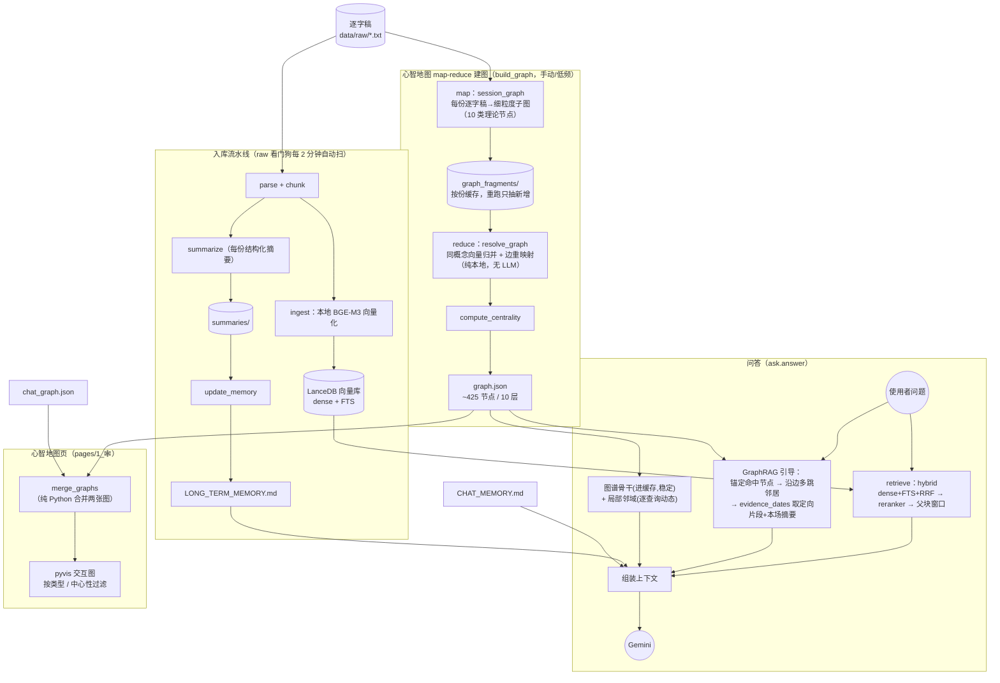

# RAG Agent —— 通用知识库系统（支持多 Workspace）

> 🆕 本系统已改造为**通用的多 Workspace 架构**，支持不同领域的知识库（心理咨询/阿含经/架构设计等）。
> 原有的心理咨询功能完全保留，作为默认 workspace 继续使用。

详细的架构设计见 [PROJECT_SPEC.md](PROJECT_SPEC.md)。这份文件讲"怎么启动/怎么维护/怎么使用 workspace"。

## 🗂️ Workspace 功能（新）

### 什么是 Workspace？

Workspace 是完全隔离的知识库实例，每个 workspace 有独立的：
- 📄 **原始文档**（`data/raw/`）
- 🗄️ **向量库**（LanceDB）
- 🕸️ **知识图谱**（graph.json）
- 💬 **对话历史**（chat_sessions/）
- 📝 **摘要和记忆**（summaries/, LONG_TERM_MEMORY.md）

不同 workspace 可以使用不同的 **Graph Schema**（节点/关系类型），适配不同领域。

### 预置的 Graph Schema

系统提供 4 种预定义 schema：

| Schema | 领域 | 节点类型 | 适用场景 |
|--------|------|---------|---------|
| **counseling** | 心理咨询 | 10 类（need/schema/belief/mode/coping/等） | 心理学概念、图式治疗、认知模型 |
| **generic** | 通用兜底 | 4 类（concept/entity/event/process） | 任意领域的快速上手 |
| **sutras** | 阿含经 | 5 类（concept/person/teaching/practice/text） | 佛学经文、教义分析 |
| **solution_arch** | 架构设计 | 6 类（requirement/component/technology/pattern/risk/decision） | 技术方案、系统设计 |

### 如何使用 Workspace？

#### 1. 在 UI 中切换（推荐）
1. 访问 http://localhost:8501（Streamlit 已休眠时会自动唤醒）
2. 侧边栏顶部的 **🗂️ Workspace** 下拉框选择
3. 查看当前 workspace 状态（文档数/图谱状态）

#### 2. 命令行创建新 Workspace

```python
from scripts.workspace_manager import create_workspace

# 创建阿含经 workspace
create_workspace(
    name="agama-sutras",
    display_name="阿含经",
    domain="sutras",
    graph_schema_mode="predefined",
    schema_file="sutras.json"
)

# 创建架构设计 workspace
create_workspace(
    name="solution-arch",
    display_name="架构设计",
    domain="solution_architecture",
    graph_schema_mode="predefined",
    schema_file="solution_arch.json"
)

# 创建通用 workspace（快速上手）
create_workspace(
    name="my-notes",
    display_name="我的笔记",
    domain="generic",
    graph_schema_mode="generic"
)
```

### Workspace 目录结构

```
private.nosync/
├── .env                      # 全局 - API keys
├── gemini_settings.json      # 全局 - LLM 参数
├── index_settings.json       # 全局 - 索引参数
└── workspaces/
    ├── counseling/           # 心理咨询（原有数据）
    │   ├── .workspace_config.json
    │   ├── data/
    │   │   ├── raw/
    │   │   ├── graph.json
    │   │   └── ...
    │   └── db/
    ├── agama-sutras/         # 阿含经
    └── solution-arch/        # 架构设计
```

---

## 〇、架构总览（先有张图心里有底）

四条数据流：**入库**（逐字稿 → 向量库 + 摘要 + 长期记忆）、**建图**（逐字稿 →
map-reduce 心智地图）、**问答**（问题 → 混合检索 + GraphRAG 引导 → LLM）、**可视化**（两张图合并渲染）。
只有调 LLM 出网，索引 / 向量化 / 归并 / 精排都在本机跑。

> **LLM 后端可切换**（见 §七「LLM 后端 provider」）：默认 **Hermes**（本地 Agent Gateway 代理，
> 转发到 xAI grok）；也可切到 **Grok**（xAI 直连）。**Gemini 后端 2026-07-25 起暂时停用**
> （原因见 §七）。下文和图里凡写「Gemini」处，除 Explicit Cache（Gemini 专有，停用期间问答一律
> 退回内联）外都同样适用于当前选中的后端。


```mermaid
flowchart TB
    RAW[("逐字稿<br/>data/raw/*.txt")]

    subgraph INGEST["入库流水线（raw 看门狗每 2 分钟自动扫）"]
        direction TB
        PARSE["parse + chunk"] --> ING["ingest：本地 BGE-M3 向量化"]
        ING --> DB[("LanceDB 向量库<br/>dense + FTS")]
        PARSE --> SUM["summarize（每份结构化摘要）"] --> SUMS[("summaries/")]
        SUMS --> UM["update_memory"] --> LTM["LONG_TERM_MEMORY.md"]
    end

    subgraph GRAPH["心智地图 map-reduce 建图（build_graph，手动/低频）"]
        direction TB
        MAP["map：session_graph<br/>每份逐字稿→细粒度子图<br/>（10 类理论节点）"] --> FRAG[("graph_fragments/<br/>按份缓存，重跑只抽新增")]
        FRAG --> RED["reduce：resolve_graph<br/>同概念向量归并 + 边重映射<br/>（纯本地，无 LLM）"]
        RED --> CENT["compute_centrality"] --> GJSON["graph.json<br/>~425 节点 / 10 层"]
    end

    subgraph QUERY["问答（ask.answer）"]
        direction TB
        Q(("使用者问题"))
        Q --> RET["retrieve：hybrid<br/>dense+FTS+RRF → reranker → 父块窗口"]
        Q --> GRG["GraphRAG 引导：<br/>锚定命中节点 → 沿边多跳邻居<br/>→ evidence_dates 取定向片段+本场摘要"]
        RET --> CTX["组装上下文"]
        GRG --> CTX
        BB["图谱骨干(进缓存,稳定)<br/>+ 局部邻域(逐查询动态)"] --> CTX
        CTX --> GEM(("Gemini"))
    end

    subgraph VIZ["心智地图页（pages/1_🕸️）"]
        MERGE["merge_graphs<br/>（纯 Python 合并两张图）"] --> NET["pyvis 交互图<br/>按类型 / 中心性过滤"]
    end

    RAW --> PARSE
    RAW --> MAP
    DB --> RET
    GJSON --> GRG
    GJSON --> BB
    LTM --> CTX
    CHATM["CHAT_MEMORY.md"] --> CTX
    GJSON --> MERGE
    CHATG["chat_graph.json"] --> MERGE
```

**心智地图这条链是本项目的 GraphRAG 核心**（详见 §四）：不是把整张几百节点的图塞给
Gemini，而是「稳定骨干进缓存 + 命中问题的局部邻域动态拼入」，并沿关系边多跳、按证据日期
在那天内取定向片段 + 本场结构化摘要（不再整份逐字稿，省 token 又不丢来龙去脉）。

**按日期继续咨询**：问题明确提到某一天时，会绕过普通的片段式检索，直接把当天的完整逐字稿
放进本轮上下文。例如在 2026 年问「读取 9 月 1 号的咨询记录，我想继续聊天」，会解析为
`2026-09-01`；`9月1号`、`九月一號`、`9/1` 都支持。省略年份时只补当前年份，不会静默猜成
其他年份；当年没有对应记录时会明确提示未找到。

**Context 自动压缩机制**（保持长对话稳定在 500K 以内）：历史对话默认只保留"检索片段 + 问题"，
不重复发送静态内容（长期记忆/心智地图骨干）；当累积 context 超过 450K 时自动两阶段压缩：
- 阶段 1（免费）：最旧的用户消息丢弃检索片段，只保留原始问题（每轮省 10K）
- 阶段 2（调用 LLM）：如仍超限，压缩最长的 assistant 回答（智能摘要，每轮省 3-6K）
压缩时会显示透明提示；侧边栏可开启"深度模式"恢复完整历史。正常使用（60 轮内）不会触发
阶段 2，长对话时每 20-30 轮约消耗 1 美元 LLM 压缩成本。详见 §七「Context 压缩策略」。

## 一、日常使用：固定入口自动唤醒 Streamlit

应用由四个 macOS launchd job 管理：轻量 wake gateway 与两个看门狗在登入时常驻；
高内存的 Streamlit 按需启动，不再整天常驻。正常情况下直接打开：

- 本机浏览器：http://localhost:8501
- 手机/其他设备：需要时先手动执行 `tailscale up`，并让该设备登入同一个 Tailscale 账号，
  再访问 http://100.64.84.111:8501；用完可执行 `tailscale down`
  （这个地址已经存在 macOS 备忘录「心理咨询AI助手 - 访问地址」里）

Tailscale 与应用服务完全解耦：未连接时，网页和两个看门狗仍会正常运行；
`start-counseling-agent` 不会自动启动或连接 Tailscale。

访问 8501 时，gateway 会启动 8502 上的 Streamlit，健康检查通过后自动跳转。关闭所有
RAG-Agent 浏览器分页后，Streamlit 连续 **30 分钟没有 TCP 客户端连接**就会自动停止，
释放 BGE-M3 embedding 与 reranker 占用的统一内存。分页一直开着时 WebSocket 仍连接，
不会被误判为空闲；下次仍从 8501 进入即可自动恢复。

侧边栏第二页是「心智地图」，可视化核心图式/应对模式/事件的关系图。

### 一键开/关（终端别名）

已在 `~/.zshrc` 配好三个别名（新开终端即可用；服务本来就开机自启，这几个是需要手动
临时关掉/重开时用的）：

```bash
start-counseling-agent    # 启动 gateway + Streamlit + 两个看门狗
stop-counseling-agent     # 停掉全部四个应用服务
status-counseling-agent   # 查看 gateway、Streamlit 与两个看门狗
```

底层是 [scripts/counseling_agent_ctl.sh](scripts/counseling_agent_ctl.sh)。除
`start|stop|restart|status` 外，还有只影响高内存网页进程的
`web-start|web-stop`；idle supervisor 就是调用 `web-stop`，不会中断两个看门狗或 gateway。
这个脚本不管理 Tailscale；远端访问按需手动执行 `tailscale up` / `tailscale down`。

## 二、检查服务是不是正常运行

```bash
status-counseling-agent            # 最省事：一条命令看全部（别名）

# 或手动逐项查：
launchctl list | grep aitherapist  # 四个 job；休眠中的 Streamlit 不会有 PID
curl -s http://localhost:8501/_stcore/health   # gateway 健康检查，应输出 ok
curl -s http://localhost:8502/_stcore/health   # Streamlit；休眠时连接失败是正常状态
tailscale status                   # 可选：需要远端访问时才检查 Tailscale
```

## 三、如果服务没起来（比如刚装完 launchd，或怀疑哪里坏了）

### 改了代码要不要重启？大多数情况：不用

已开启 Streamlit 热重载（`.streamlit/config.toml` 里的 `runOnSave = true` + `watchdog` 事件监控）：
**改了本项目的 `.py`（`app.py` / `pages/` / `scripts/` / `config.py`）存盘后，跑着的服务会自动重跑并
重新 import 变更的模块**，下一次交互即生效，不用手动重启。历史上多次踩的坑（改了 `scripts/` 里的
模块但跑着的进程还用旧代码），就是因为 Streamlit 每次 rerun 只重新执行 `app.py`，而 import 进来的
模块缓存在 `sys.modules` 里——现在交给热重载自动处理了。（原理和「什么时候仍要重启」见下方注 ⭐）

> ⭐ **仍需手动重启**的少数情况：① 改了 `.streamlit/config.toml` 本身；② 给某模块**新增了顶层
> import**（偶尔热重载捕捉不到）；③ 想强制重载已进内存的大模型（换了 embedding / reranker 的
> model / device / fp16——这些是进程内单例，见 §七）。这几种最省事、最可靠的一条命令是：
>
> ```bash
> bash scripts/counseling_agent_ctl.sh restart   # = stop; sleep 2; start，一条搞定
> ```
>
> ⚠️ 别再手动敲 `launchctl bootout` 紧接着 `bootstrap`——`bootout` 是异步的，紧跟着 `bootstrap`
> 有概率撞上 `Bootstrap failed: 5: Input/output error`（服务还没完全卸载）。上面的 `restart`
> 子命令内置了 `sleep 2` 间隔并对「已加载」用 `kickstart`，不会踩这个race。

### 手动开关高内存网页进程

```bash
cd "/Users/andytsang/Documents/Project/RAG-Agent"

bash scripts/counseling_agent_ctl.sh web-stop   # gateway + 两个看门狗继续运行
bash scripts/counseling_agent_ctl.sh web-start  # 手动启动 Streamlit（或直接访问 8501）
```

### 查看日志排查问题

```bash
cat /tmp/streamlit.log
cat /tmp/streamlit_wake_gateway.log
cat /tmp/chat_memory_watcher.log
cat /tmp/raw_ingest_watcher.log
```

### 如果 launchd 配置本身坏了/需要重装

`scripts/launchd/` 目录下是四份应用 plist 源文件（和 `~/Library/LaunchAgents/` 里生效的那份保持同步）：

```bash
cp "/Users/andytsang/Documents/Project/RAG-Agent/scripts/launchd/"*.plist ~/Library/LaunchAgents/
for label in com.andytsang.aitherapist.wakegateway com.andytsang.aitherapist.streamlit com.andytsang.aitherapist.chatmemorywatcher com.andytsang.aitherapist.rawingestwatcher; do
  launchctl bootout "gui/$(id -u)/$label" 2>/dev/null
  launchctl bootstrap "gui/$(id -u)" ~/Library/LaunchAgents/$label.plist
done
```

Streamlit plist 的 `RunAtLoad` / `KeepAlive` 都是 false，所以上述重装只会加载它，不会立即占用
模型内存；gateway 收到 8501 请求后才 `kickstart`。其余三个 job 会立即启动。

⚠️ **已知的坑（`Operation not permitted`）**：这个项目目录在 `~/Documents` 底下，而 macOS 的
TCC（隐私保护）对 launchd 拉起的进程**按可执行文件逐个**授予 `~/Documents` 读取权限。所以现象是：
同一条命令在终端里跑得好好的，交给 launchd 就报 `PermissionError: [Errno 1] Operation not
permitted: .../RAG-Agent/.venv/pyvenv.cfg`（venv 连自己的配置都读不到 → `init_import_site` 直接死）。

**判断方法**（别猜，跑一个 probe job）：写一份最小 plist，`ProgramArguments` 直接 exec 那个解释器
二进制去读项目里任意文件，看它是否 `Operation not permitted`。实测结论：

| launchd 直接 exec 的二进制 | 能读 `~/Documents/Project/...` |
|---|---|
| `/bin/bash`（再由它去读） | ❌ |
| `/Users/andytsang/.local/bin/python3.11`（旧项目 venv 的目标） | ✅ 早年授权过 |
| `/Library/Developer/CommandLineTools/usr/bin/python3`（旧 3.9 系统 Python） | ❌ 没授权 |
| uv 管理的 cpython-3.12.x（当前 `.venv` 目标） | ⚠️ 换解释器后需重新授权，或把项目挪出 `~/Documents` |

关键在于**被授权的是解释器二进制本身，不是脚本、也不是包一层 `bash -c` 就能绕过**（包 bash 只会
让被授权对象变成 bash）。`.venv/bin/python3` 只是个 symlink，真正参与判定的是它指向的目标——
用 `readlink -f .venv/bin/python3` 看清楚指向谁。

两种解法（见 §一「当前状态」里的完整步骤）：给那个解释器加「完全磁盘访问权限」，或者把整个项目
挪到 `~/Documents` 之外（`~/Projects` 之类）——**后者更彻底**，TCC 根本不管那些路径，也省掉以后
每换一次 Python 版本就要重新授权一次。

### 完全手动跑（不经过 launchd，纯前台调试用）

**推荐方式（自动处理端口冲突）**：
```bash
cd "/Users/andytsang/Documents/Project/RAG-Agent"
./scripts/restart_ui.sh          # 自动重启 UI（固定 8502 端口）
```

**手动方式**：
```bash
cd "/Users/andytsang/Documents/Project/RAG-Agent"
source .venv/bin/activate
streamlit run app.py --server.port 8502       # Ctrl+C 结束
python -m scripts.chat_memory_watcher          # 另开一个终端跑
```

**说明**：
- `restart_ui.sh` 脚本会自动终止占用 8502 端口的旧进程
- 日志保存在 `/tmp/streamlit_8502.log`
- 固定使用 **8502 端口**（避免与其他服务冲突）

## 四、维护类命令（不是每天要跑，按需执行）

```bash
cd "/Users/andytsang/Documents/Project/RAG-Agent"
source .venv/bin/activate

# 有新的一周咨询逐字稿时：直接把 .txt 丢进
#   private.nosync/workspaces/counseling/data/raw/
# （每个 workspace 各有自己的 raw/，路径 = workspaces/<workspace>/data/raw/）
# 即可——「raw 入库看门狗」（com.andytsang.aitherapist.rawingestwatcher，见 §一）每 2 分钟扫一次，
# 发现没入库的新文件就自动跑一条龙 parse→chunk→embed→摘要→更新长期记忆，无需手动敲命令。
# （文件写完 30s 后才处理，避免抓到复制到一半的半个文件；日志在 /tmp/raw_ingest_watcher.log）
# 每次入库/重建/跳过都会自动追加一条「索引变更记录」，可在侧边栏「📚 已索引的咨询记录」里查看
#
# 想立刻手动入库某份、或看门狗因故没跑起来时，仍可手动执行（效果完全一样，看门狗底层就是调它）：
python -m scripts.ingest_new private.nosync/workspaces/counseling/data/raw/新文件.txt

# 手动重新生成长期记忆（汇总全部咨询摘要）
python -m scripts.update_memory

# 重新生成真实咨询心智地图（map-reduce 建图，也可以在心智地图页面点按钮）：
#   · 增量：只对没缓存 fragment 的新逐字稿调 Gemini 抽子图，其余读 graph_fragments/ 缓存 → 便宜
#   · 归并（reduce）是纯本地向量化，不调 LLM。所以只想调「归并松紧」时（改 graph_utils.py 的
#     MERGE_SIM_THRESHOLD：调高=保留更多细节节点，调低=合并更多），重跑本条几乎免费、几秒完成
#   · 全量重抽所有份（贵，53+ 次 Gemini 调用，只有换了抽取 prompt/schema 才需要）：加 --force
python -m scripts.build_graph
# python -m scripts.build_graph --force   # 全量重抽

# 手动重新生成 AI 对话记忆 + 它的心智地图（便宜，只处理聊天记录；聊天记忆看门狗每 30
# 分钟闲置也会自动跑这两个，正常不需要手动跑，也可以在 Streamlit 侧边栏点按钮）
python -m scripts.update_chat_memory
python -m scripts.build_chat_graph

# 全量重建向量库（一般用不到，除非改了分块/FTS 参数、要对全部历史记录重新索引）
# 也可以在侧边栏「⚙️ 索引设置」弹窗底部点「全量重建」按钮，效果一样（都会记一条变更记录）
python -m scripts.ingest
```

### 不想等看门狗：UI 里点一下就入库

把 .txt 丢进 `raw/` 后，打开侧边栏「📚 已索引的咨询记录」——如果有还没入库的文件，弹窗顶部会
直接列出来，并给一个 **「⚡ 立即入库这 N 份」** 按钮，点了就在前台跑完整流程（parse → 分块 →
本地向量化 → LLM 摘要 → 更新长期记忆），一份约 1–2 分钟，期间别关页面。每份独立成功/失败，
坏文件（比如文件名少了 14 位日期前缀）只会自己报错，不拖垮同批其他文件。

这个按钮和看门狗、命令行走的是**同一个** `scripts/ingest_new.py`，「哪些还没入库」也共用同一个
`pending_raw_files()` 判定（文件名不在 `chunks.jsonl` 里就算没入库）。之所以要这条手动通路：
看门狗是个可能悄悄挂掉/指错目录的单点（2026-07-26 就是这么坏的，见 §一），有个不依赖它的入口，
系统就不会因为一个组件失效而整体停摆。

**已入库但摘要生成失败怎么办**：入库（chunks + 向量化）和摘要（调 LLM）是两个独立步骤，
后者失败（比如 2026-08-08 那次，hermes 的 xAI OAuth 凭证过期导致摘要调用一路 401）不会影响
前者已经落地的数据，但这份文件既不会出现在「待入库」清单里、看门狗也不会重试。同一个弹窗
里如果检测到这种「已入库但没摘要」的文件，会另外列出来并给一个 **「🔁 补生成这 N 份摘要」**
按钮——只重跑摘要这一步，不会重复入库或重复向量化。

> ⚠️ **改分词器/索引参数记得看清改的是哪一层**：`config.py` 里的 `FTS_BASE_TOKENIZER` 等只是
> **默认值**，真正生效的是 `private.nosync/index_settings.json`（UI「⚙️ 索引设置」写的就是它）。
> 默认已是 `jieba/default`（Python 3.12 + lancedb≥0.29）；若设置文件仍是旧的 `ngram`，会一直用
> ngram，直到你在 UI 改完或对齐设置文件并**重建 FTS**。排查时先 `cat private.nosync/index_settings.json`，
> 别只看 `config.py`。删掉这个文件 = 恢复全部默认值。

**索引跑在哪：全程本地。** 分块是纯 Python，向量化用本地 BGE-M3 模型（跑在 Apple GPU / MPS 上，
见 `config.py` 的 `EMBEDDING_DEVICE`），向量库是本机 LanceDB 文件（`private.nosync/db/`）——
建索引和检索都**不出网**。唯一出网的是问答 / 摘要时调 LLM（默认 hermes：走本地代理再转 xAI；
用 grok 时直连 xAI，见 §七）。侧边栏「📚 已索引的咨询记录」
可以看当前索引了哪些逐字稿（日期 / 片段数 / 是否已生成摘要）+ 最近的变更记录；
「⚙️ 索引设置」可以像「⚙️ LLM 设置」一样在 UI 里直接调检索 / 分块 / 向量化 / 分词 / Reranker 精排参数
（弹窗顶部还有一张「哪些参数改完需要全量重建」的速查表）。

心智地图页面看到的图，是 `private.nosync/data/graph.json`（真实咨询）和
`private.nosync/data/chat_graph.json`（AI 对话记忆，便宜）合并显示的——合并本身是纯 Python 操作，不会额外调用 Gemini，
后者带虚线边框区分来源，且可能有 `relates_to` 类型的边把两者连起来（比如聊天里提到的
某个模式，其实呼应了真实咨询里已经识别出的某个核心图式）。

**真实咨询图（`graph.json`）是 map-reduce 逐份抽取再归并出来的**（`scripts/build_graph.py` 编排、
`scripts/session_graph.py` 做 map、`scripts/graph_utils.py` 的 `resolve_graph` 做 reduce）：每份逐字稿
**直接读原文**各抽一张细粒度子图，节点按现代心理学理论分 10 层（核心情感需要 / 依附对象 / 早期
不适应图式 / 中间信念 / 图式模式 / 应对防御 / 触发情境 / 自动思维 / 情绪 / 关键事件；理论依据见
`scripts/session_graph.py` 顶部注释），再跨份把「同一概念」按语义相似度归并。粒度远细于旧版一次性
全局抽取（约 425 节点 vs 旧的 33）。节点/关系类型的**单一真相源**在 `scripts/graph_utils.py` 的
`NODE_TYPES` / `RELATION_TYPES`——新增类型只改这一处，问答上下文（`ask.py`）和可视化页会自动跟上。

**这张图不只是给人看，还回喂问答（GraphRAG）**：`scripts/ask.py` 的 `answer()` 里，问题会先
**锚定**到最相关的图式/信念/模式/应对节点，再**沿关系边多跳**把关联的深层概念一并检索，并按命中
节点/边上的 `evidence_dates` 把「关键证据日」的内容拼进上下文。这里刻意**不再整份逐字稿**（一整天
大量无关对话既占 token 又稀释注意力），而是用锚点概念的向量在那天的块里做一次**定向检索**取最相关
的几段，再附上该场的**结构化摘要**（`summaries/` 里预生成的，几百 token 概括整场弧线）——覆盖面反而
更全、成本约 1/3（实测一场 12820 字 → 4602 字）。连接边证据用边两端概念的合并文本去检索，正好印证
这条多跳关系。图太大不能整份塞给 Gemini，所以拆成「**骨干**（中心性最高的根源驱动节点，进 Explicit
Cache，稳定）+ **局部邻域**（命中概念及其 k-hop 邻居，逐查询动态拼入）」。相关阈值/跳数/骨干大小等
常数都在 `ask.py` 顶部（`GRAPH_*`）；证据日的取几天/每天几段/扩多宽/是否附摘要可在 UI 热调（见 §七）。

## 五、从零搭建（换新机器/灾难恢复时用）

```bash
cd "/Users/andytsang/Documents/Project/RAG-Agent"

# 1. Python 3.12 环境（uv；pyproject 钉 requires-python ==3.12.*）
#    安装 uv：https://docs.astral.sh/uv/getting-started/installation/
uv sync --group dev
source .venv/bin/activate
python --version   # 应显示 3.12.x

# 2. 中文 FTS 分词词典（默认 FTS_BASE_TOKENIZER = "jieba/default"，需词典一次）
#    pylance 不进常驻依赖，用 --with 临时拉：
uv run --with pylance python -m lance.download jieba
#    若 dict 损坏/缺失，可从 jieba-rs 补一份（路径因 OS 而异）：
# curl -s "https://raw.githubusercontent.com/messense/jieba-rs/main/jieba/src/data/dict.txt" \
#   -o "$HOME/Library/Application Support/lance/language_models/jieba/default/dict.txt"
#    不想用 jieba 时：在「⚙️ 索引设置」把 base_tokenizer 改回 "ngram" 即可（零额外依赖）。

# 3. 个人数据放在 private.nosync/ 里。先建目录，把 LLM 后端的 key 写进去
#    （这是凭证，已被 .gitignore 排除，别提交进 git——见第九节）：
mkdir -p private.nosync/data
# 默认后端 hermes 走本地代理（key 任意、base_url 默认 http://127.0.0.1:8645/v1），这步可省；
# 用 grok 直连 xAI 时写 XAI_API_KEY。gemini 当前停用（见 §七），GEMINI_API_KEY 暂时用不上。
echo "XAI_API_KEY=你的key" > private.nosync/.env
#    （provider 选择本身也可以直接在 UI「⚙️ LLM 设置」里切，无需写进 .env）
#    （务必确认没有设 ANTHROPIC_API_KEY 环境变量，否则 Claude Code 会改走 API 计费而不是
#     Pro 订阅——见 PROJECT_SPEC.md §4.3）

# 4. 把全部咨询逐字稿放进 private.nosync/data/raw/，然后跑一遍完整流水线
python -m scripts.chunk          # 解析+分块，写 private.nosync/data/processed/chunks.jsonl
python -m scripts.ingest         # 向量化+建 LanceDB（private.nosync/db/）
python -m scripts.summarize      # 每份逐字稿生成结构化摘要（较慢，几十份大概跑半小时+）
python -m scripts.update_memory  # 汇总生成 LONG_TERM_MEMORY.md
python -m scripts.build_graph    # map-reduce 生成真实咨询心智地图 graph.json（直接读 raw/ 逐字稿，
                                 # 每份抽一张子图缓存到 data/graph_fragments/，再归并；首次是全量，较慢）

# 5. 可选远端访问：安装 Tailscale.app；需要时才执行 tailscale up

# 6. 参考 scripts/launchd/ 里的四份应用 plist，改好路径后装到 ~/Library/LaunchAgents/
#    （见上面"如果 launchd 配置本身坏了"那一节的命令）
```

## 六、备份

数据不再当作隐私硬约束（见 §九），所以最省事的异地备份就是**把 `private.nosync/` 纳入 git 并推到
（建议私有）GitHub 仓库**。两点注意：

- `.env` 和 `gemini_settings.json` 是凭证，已被 `.gitignore` 排除，别强制加进去（推到公开仓库 = 密钥外泄）。
- `private.nosync/db/` 是 LanceDB 二进制，仓库会随咨询量变大。介意体积的话，只备份能重现一切的源头即可
  ——`data/raw/`（逐字稿）+ `data/chat_sessions/`（聊天历史），其余都能重新跑第五节流水线生成。

以下内容一旦丢失、又没进 git 或其他备份，就**无法重新生成**：

- `private.nosync/data/raw/`（原始逐字稿——如果 Google Drive 上还留着副本，可以重新下载）
- `private.nosync/data/chat_sessions/`、`private.nosync/CHAT_MEMORY.md`（和 AI 的聊天历史——
  **没有任何其他地方保存，丢了就是丢了**）
- `private.nosync/db/`（向量库）、`private.nosync/data/summaries/`、`private.nosync/data/graph_fragments/`、
  `LONG_TERM_MEMORY.md`、`graph.json`、`chat_graph.json`（这几个能从 raw/ 重新跑第五节流水线复原，但要花
  时间 + 重新调 Gemini；其中 `graph_fragments/` 是建图的缓存，丢了下次 build_graph 会全量重抽一遍）

另外 Time Machine 默认会备份 `.nosync` 目录（`.nosync` 只挡 iCloud，不挡 Time Machine），所以只要
Time Machine 开着且盘在，就已经有一份本地备份。

## 七、关键配置速查

### 能在 UI 直接改的（改完下一次调用即生效，无需重启）

| 想调整什么 | 在哪改 |
|---|---|
| **LLM 后端 provider（grok / hermes / copilot_cli；gemini 停用中）** | Streamlit 侧边栏「⚙️ LLM 设置」→ 🔀 LLM 后端 provider（见下方「LLM 后端 provider」小节）|
| **Gemini API Key** | 「⚙️ LLM 设置」→ API Key（留空=保留现有，填入=覆盖；provider 停用中，仅保留备用）|
| **xAI（Grok）API Key** | 「⚙️ LLM 设置」→ API Key 区（用 provider=grok 时）|
| **Hermes Base URL / API Key** | 「⚙️ LLM 设置」→ Hermes 区（用 provider=hermes 时；key 任意，代理自己夹 OAuth）|
| **对话（问答）的 模型 / 思考深度 / 温度 / 最大输出 token** | 「⚙️ LLM 设置」左栏（模型如 grok-4.5 / gpt-5.6-sol）|
| **摘要类任务的 模型 / 思考深度 / 温度** | 「⚙️ LLM 设置」右栏 |
| **摘要类的最大输出 token（按任务分档）** | 「⚙️ LLM 设置」右栏：文本摘要类 / 对话记忆图谱 / 真实咨询图谱 各一个（图谱输出大，别调太低否则会截断）|
| AI 人设/流派路由规则 | 「⚙️ 编辑 System Instruction」（支持版本历史：每次保存自动记一条 + AI 生成变更摘要，可展开查看历史版本全文并恢复）|
| **检索 top_k / 父块窗口扩展** | 「⚙️ 索引设置」→ 检索（改完下一次问答立即生效）|
| **分块大小 / 重叠** | 「⚙️ 索引设置」→ 分块（只影响之后新入库的记录；要对历史生效点弹窗底部「全量重建」）|
| **本地 Embedding：模型 / 设备(CPU/MPS/CUDA) / 批大小 / fp16** | 「⚙️ 索引设置」→ Embedding（模型 / 设备改动需**重启服务**才生效，因模型进程内缓存为单例）|
| **FTS 关键词分词器 / ngram 范围** | 「⚙️ 索引设置」→ 关键词检索分词（改完需**重建索引**生效）|
| **Reranker 开关 / 候选数 rerank_top_k / 最终保留数 final_top_k** | 「⚙️ 索引设置」→ Reranker（纯查询期后处理，改完下一次问答立即生效，无需重建）|
| **相关性阈值 min_score / 保底条数 min_keep** | 「⚙️ 索引设置」→ Reranker（低于阈值的片段不进上下文；`min_score = 0` 关掉这个机制。纯查询期后处理，改完立即生效）|
| **Reranker 模型 / 设备 / fp16** | 「⚙️ 索引设置」→ Reranker（模型 / 设备 / fp16 改动需**重启服务**才生效，因模型进程内缓存为单例）|
| **心智地图证据片段：证据日数 / 每日段数 / 片段扩展 / 是否附摘要** | 「⚙️ 索引设置」→ 心智地图证据片段（纯查询期后处理，改完下一次问答立即生效；调大=上下文更丰富、token 更多，证据日数设 0 可关掉这条通路）|

Gemini / provider 参数存在 `private.nosync/gemini_settings.json`（含 Gemini / xAI API Key + provider 选择 +
Hermes base_url，是凭证，已被 `.gitignore` 排除）；索引参数存在 `private.nosync/index_settings.json`。
两个文件都是**删掉 = 恢复对应的默认值**（默认值就是 `config.py` 里的 `GEMINI_*` / `HERMES_*` /
`CHUNK_*` / `RETRIEVAL_*` / `EMBEDDING_*` / `FTS_*` / `RERANKER_*`（含 `RERANKER_MIN_SCORE` /
`RERANKER_MIN_KEEP`）/ `USE_RERANKER` / `FINAL_TOP_K` /
`GRAPH_EVIDENCE_*` 常量；
「恢复默认参数」按钮会保留 API Key / provider 选择）。API Key 也可以继续放 `private.nosync/.env`
（UI 里没填时会回退读它：`GEMINI_API_KEY` / `XAI_API_KEY` / `HERMES_API_KEY`）。

> 注意「立即生效」的范围：**检索类 + Reranker 开关 / 候选数 / 保留数**参数下一次问答就生效；
> **分块 / FTS** 参数只在下次入库或全量重建时才用到；**Embedding / Reranker 的模型 / 设备 / fp16**
> 因为模型在进程内缓存成单例，要重启 Streamlit 服务、下次加载模型时才会读到新值（批大小在下次建 rows
> 时即生效）。UI 里每处都标了这个区别。

### LLM 后端 provider（grok / hermes / copilot_cli；gemini 暂时停用）

所有对 LLM 的调用都收口在 [scripts/llm.py](scripts/llm.py) 的 `ask_llm()`，通过一个 provider 开关在
后端间切换（在「⚙️ LLM 设置」→ 🔀 LLM 后端 provider 里选，**下一次调用即生效、无需重启**）：

| provider | 是什么 | key / 端点 | 备注 |
|---|---|---|---|
| **hermes**（默认） | 本地 **Hermes Agent Gateway** 代理（OpenAI 兼容，转发到 xAI grok、自己夹 OAuth）| Base URL 默认 `http://127.0.0.1:8645/v1`，key 任意（默认 `sk-unused`）| 模型填 `grok-4.5`（摘要用更便宜的 `grok-4.3`）；走本地代理、不用自己管 xAI 额度 |
| **grok** | xAI 直连（OpenAI 兼容 `api.x.ai/v1`）| `XAI_API_KEY` | 需 xAI 账号有额度；模型填 `grok-4.5` 等 |
| **copilot_cli** | 本机已登录的 GitHub Copilot CLI | 不需要 API key 或 HTTP gateway | 模型如 `gpt-5.6-sol`；每次调用都禁用工具、MCP、项目 instructions 和 remote export；CLI 不提供稳定 token usage，UI 中用量显示为 0 |
| ~~**gemini**~~ | Google Gemini 直连（唯一支持 **Explicit Cache**）| `GEMINI_API_KEY` | ⛔ **2026-07-25 起暂时停用**，见下方「gemini 为什么停用」|

要点：

- **切后端后记得同步改「模型」框**：provider 只决定走哪个后端，对话/摘要各自的模型名仍在
  「⚙️ LLM 设置」左右两栏的「模型」框里填（hermes/grok 填 grok 模型，copilot_cli 填 Copilot
  可用模型，例如 `gpt-5.6-sol`）。
- **grok / hermes 是 OpenAI 兼容后端，共用同一套代码**（`scripts/llm.py` 的 `_OPENAI_PROVIDERS`
  注册表 + `_ask_openai_compatible()`）。要再加任何 OpenAI 兼容网关，只需在注册表加一行 +
  在 `scripts/settings.py` 的 `VALID_PROVIDERS` 加个名字。
- **`thinking_level` 映射**：Gemini 的 minimal/low/medium/high → OpenAI 兼容后端的 `reasoning_effort`
  （minimal→low，其余同名），放在请求的 `extra_body` 里。少数模型（如 grok-4）不接受该参数时会
  自动去掉重试。`grok-4.5` 支持 low/medium/high 且默认 high、不能关。
- **Explicit Cache 仅 gemini 有**：用 grok/hermes 时 `scripts/context_cache.get_cache_name()`
  直接返回 None，问答自动退回把 system instruction + 长期记忆 + 骨干图内联进上下文（功能不变，
  只是省不到那部分缓存费）。gemini 停用期间这条通路一直是内联。
- **依赖**：grok/hermes 走 `openai` SDK（已在 `requirements.txt`）指向对应 base_url。
- **copilot_cli 限制**：需要先完成 `copilot` 登录；单次调用 300 秒超时。CLI 没有等价的 temperature /
  max token 参数，也没有服务端 JSON Schema 约束，因此结构化任务会把 schema 写入 prompt，并在本地
  拒绝无效 JSON。失败会明确返回「未安装／超时／退出码／空响应／无效 JSON」，不会悄悄切换后端。
  Streamlit、raw watcher 与 chat-memory watcher 的 launchd plist 都显式加入 Apple Silicon
  Homebrew（`/opt/homebrew/bin`）与 Intel Homebrew（`/usr/local/bin`）；launchd 不读取 `.zshrc`。
  若终端可执行 `copilot --version`、网页却报「copilot 不在 PATH」，请按 §三重装四份 plist。

#### gemini 为什么停用

**历史原因（已解除）**：Gemini 3.x 用 `thinking_level` 取代 `thinking_budget`。旧环境钉在
Python 3.9 时只能装到 `google-genai` 1.47.0，其 `ThinkingConfig` 不认 `thinking_level`，调用会被
pydantic 直接拒。支持该参数的 2.x 要求 Python ≥ 3.10。

**现状（2026-07-30）**：venv 已是 **Python 3.12** + **google-genai 2.x**（`ThinkingConfig` 含
`thinking_level`），技术 blocker 已解除。`gemini` 仍登记在
[`scripts/settings.py`](scripts/settings.py) 的 `DISABLED_PROVIDERS`（产品选择，默认 hermes；
UI 会显示停用原因）：`provider()` 读到 `gemini` 会回退 hermes，`save()` 也拒绝写回。
`scripts/llm.py` 的 `_ask_gemini()` 与 Explicit Caching 代码**原样保留**。

**恢复步骤**（两步，环境已就绪）：

1. `scripts/settings.py`：把 `"gemini"` 加回 `VALID_PROVIDERS`、从 `DISABLED_PROVIDERS` 删掉
   （需要的话把 `DEFAULT_PROVIDER` 改回 `"gemini"`）。
2. `config.py`：把默认模型名换回 `GEMINI_MODEL = "gemini-3.5-flash"`、
   `GEMINI_SUMMARY_MODEL = "gemini-3.1-flash-lite"`。

### 参数改动是否需要「全量重建」速查

「⚙️ 索引设置」弹窗顶部也有同一张表（点「❓ 哪些参数改完需要『全量重建』？」展开）。

| 参数类型 | 是否需要全量重建 | 说明 |
|----------|------------------|------|
| **分块大小 chunk_size** | ✅ **需要** | 直接改变每块文字内容，旧向量全部失效 |
| **块间重叠 chunk_overlap** | ✅ **需要** | 同上 |
| **FTS 分词器 base_tokenizer** | ✅ **需要** | 影响 FTS 索引，必须重建 FTS |
| **ngram 最短 / 最长** | ✅ **需要** | 同上，属于 FTS 参数 |
| **Embedding 模型**（换模型） | ✅ **需要** | 向量空间变了，旧向量不能用（且需重启服务）|
| **Embedding 维度** | ✅ **需要** | 同上 |
| **top_k**（检索返回数量） | ❌ 不需要 | 只影响查询时取多少，改完立即生效 |
| **父块窗口扩展** | ❌ 不需要 | 后处理逻辑，改完立即生效 |
| **batch_size** | ❌ 不需要 | 只影响 ingest 速度，不影响已存数据 |
| **device (mps/cpu)** | ❌ 不需要 | 只影响计算设备（换 embedding device 需重启服务）|
| **Reranker 开关 / rerank_top_k / final_top_k** | ❌ 不需要 | 纯后处理，改完立即生效 |
| **Reranker min_score / min_keep**（相关性阈值） | ❌ 不需要 | 纯后处理，改完立即生效 |
| **Reranker model / device / fp16** | ❌ 不需要 | 不动向量库，但需重启服务生效 |
| **心智地图证据片段（证据日数 / 每日段数 / 扩展 / 摘要）** | ❌ 不需要 | 纯查询期后处理，改完立即生效 |
| **RRF 或其他 fusion 方式** | ❌ 不需要 | 查询时逻辑 |

### Context 压缩策略（自动触发，保持长对话在 500K 以内）

系统会自动管理对话历史的 context 大小，避免超过 Hermes/Grok 的 500K 上限。压缩分两阶段：

**阶段 1：快速压缩（免费，毫秒级）**
- 历史对话默认只保留"检索片段 + 问题"，不重复发送静态内容（长期记忆 + 心智地图骨干）
- 当累积 context > 450K 时，最旧的用户消息丢弃检索片段，只保留原始问题
- 每轮省约 10K 字符
- 效果：20 轮 = 373K，40 轮 = 430K（自动压缩后）

**阶段 2：智能压缩（调用 LLM，只在必要时触发）**
- 如果阶段 1 全部压缩后仍超限（例如 assistant 回答特别长），压缩最长的 assistant 回答
- 调用 LLM 将完整回答压缩成智能摘要（保留关键信息，压缩到原长度的 40%）
- 只压缩 > 3K 的回答，短回答保留完整
- 每轮省约 3-6K 字符
- 成本：每 20 轮约消耗 150K input tokens ≈ $0.75（Hermes @ $5/1M）

**UI 反馈**：
- 侧边栏实时显示"累积 XXK 字符"
- 压缩触发时显示明确提示：`📦 自动压缩：已压缩用户消息 15 轮 + AI 回答 5 轮`
- 可在侧边栏开启"深度模式"恢复完整历史（context 会更大）

**硬上限**：超过 60 轮对话时自动截断最旧的历史（避免 assistant 回答累积超限）

详细实现见 `scripts/ask.py` 第 768-850 行。

### 只能改代码的（不常动）

| 想调整什么 | 改哪个变量 |
|---|---|
| Context 压缩阈值 / 轮数上限 | `scripts/ask.py` 的 `answer()` 函数参数：`max_context`（默认 450K）、`max_turns`（默认 60） |
| Explicit Cache 的 TTL/门槛 | `scripts/context_cache.py` 的 `CACHE_TTL`、`MIN_CACHE_TOKENS` |
| 聊天记忆看门狗的空闲阈值 | `scripts/chat_memory_watcher.py` 的 `IDLE_MINUTES` |

> Reranker 相关参数（开关 / 候选数 / 最终保留数 / 模型 / 设备 / fp16）现在都能在「⚙️ 索引设置」
> → Reranker 里直接改，不必再改代码；`config.py` 里的 `USE_RERANKER` / `RERANKER_*` / `FINAL_TOP_K`
> 只作为默认值（删掉 `private.nosync/index_settings.json` 即恢复它们）。
>
> 检索流程：**hybrid（dense + FTS + RRF）取 `rerank_top_k` 候选 → `bge-reranker-v2-m3`
> cross-encoder 精排取 `final_top_k` → 相关性阈值过滤（`min_score` / `min_keep`）→ 父块扩展
> （±窗口）→ 合并连续窗口**。reranker 本地跑（mps），
> 不出网，首次使用会自动下载模型（约 2GB+）；精排失败会自动 fallback 回 hybrid 排序，不影响可用性。
> 关掉 reranker 开关就退回纯 hybrid（取「⚙️ 索引设置」里的 `top_k`）。开关 / 候选数 / 保留数改完
> 下一次问答立即生效；模型 / 设备 / fp16 因进程内单例缓存，改完需重启服务生效。
>
> 实现细节（给接手的 agent）：`scripts/reranker.py` 用的是 **sentence-transformers 的 `CrossEncoder`**
> 而不是 `FlagEmbedding.FlagReranker`——因为本机 `transformers 5.x` 与 `FlagEmbedding 1.4.0` 的
> reranker 不兼容（后者调用已移除的 `tokenizer.prepare_for_model()`，会抛 AttributeError）。
> 模型是同一个，行为等价，分数归一化到 0–1。如果哪天把 transformers 降到 4.x，才可以
> 换回 FlagReranker。
>
> ⚠️ **分数只能 sigmoid 一次**（2026-07-25 修）：sentence-transformers 5.x 的 `CrossEncoder` 会按模型
> config 自带的 `activation_fn`（bge-reranker-v2-m3 是 `Sigmoid`）先归一化，`predict()` 返回的已经是
> 0–1。之前代码又 sigmoid 了一遍，结果无关片段（logit ≈ -11 → 1.6e-5）全被挤到 0.500004、彼此只差
> 1e-6，fp16 下直接相等 → 排序全是 tie，**精排等于白跑、退化成 hybrid 原序**。现在按 `activation_fn`
> 判断只补"缺失的那一次"。修好后实测：切题 query 的 top1 有 0.42–0.87，完全无关的（「今天天气」
> 「巴黎奥运会金牌榜」）掉到 0.0003–0.0035 —— 注意绝对值整体偏低（chunk 是长段落对话），
> 相关性阈值要按 **0.01 量级**定标，照搬通用的 0.5 会把真实片段全滤掉。

> **相关性阈值（不引用不相关的碎片）**：精排之后加一道 `min_score`（默认 **0.01**）过滤——
> 分数低于它的片段直接不进上下文，免得 8 条里 6 条是噪音、把注意力稀释掉，AI 反而绕过检索
> 内容凭记忆答。**只有"一条都没过线"时**才退回分数最高的 `min_keep`（默认 3）条，并在 prompt
> 最前面加一句"以下片段相关性都很低，不要硬套，找不到依据就直说没有相关记录"——宁可给弱材料
> + 明确警告，也不要让模型在零材料下编。片段头部还会写上 `｜相关性 0.183`，UI 的「引用来源」
> 里也会标出「低相关·保底」。
>
> ⚠️ 相关/无关**存在重叠区**：实测「怎么修理汽车引擎」能拿到 0.10，而切题的「最近的焦虑和睡眠」
> top1 只有 0.035（语料本身覆盖少）。所以阈值只负责砍掉 0.001 量级的噪音尾巴，不做硬判；
> 想更严就把 `min_score` 调到 0.03–0.05，想完全关掉就设 **0**（行为回到改动前）。

> **繁简统一（检索层不变量）**：语料库全是简体（转写工具输出），但你常打繁体。FTS / dense 对繁简
> 重叠，「水煙」和「水烟」零重叠，dense 也会漏——实测繁体 query 检索不到语料里唯一提到「水烟」的
> 两个块。所以约定：**进检索/匹配的文本一律先过 `scripts/text_norm.to_simplified()`，展示用的原文
> 不动**（`Chunk.raw_text`、prompt 里你的原问题都保留原字形）。落点三处：`chunk.py` 生成
> `Chunk.text`、`retrieve()` 的 query、图谱锚点匹配的 question。对现有简体语料是幂等 no-op，
> **不需要重建索引**。依赖 `zhconv`（纯 Python）；没装会降级成原样返回，只是繁体 query 会漏。

## 八、目录结构速查

代码/配置在项目根目录；个人数据在 `private.nosync/`。两者现在都可进 git——只有 `private.nosync/` 里
标 🔑 的两个凭证文件除外（见 §九）。

```
—— 根目录（代码/配置，不含个人内容）——
app.py                      # Streamlit 聊天主页
pages/1_🕸️_心智地图.py       # 心智地图可视化页
config.py                   # 所有路径/参数集中在这里
.streamlit/config.toml      # Streamlit 服务配置：已开热重载（runOnSave + watchdog 事件监控），见 §三
system_instruction.md       # AI 人设/流派路由规则（可在设置弹窗里编辑，不含个人逐字稿）
scripts/                    # 所有后端脚本（parse/chunk/ingest/summarize/ask/graph_utils/...）
scripts/build_graph.py      # 真实咨询心智地图 map-reduce 编排（map=session_graph，reduce=graph_utils.resolve_graph）
scripts/session_graph.py    # map 步：单份逐字稿→细粒度子图（10 类理论节点），按份缓存到 graph_fragments/
scripts/graph_utils.py      # 节点/关系分类单一真相源(NODE_TYPES/RELATION_TYPES) + 归并 resolve_graph + 中心性 + merge_graphs
scripts/chat_memory_watcher.py   # 聊天记忆看门狗：闲置 30 分钟自动更新 AI 对话记忆 + 其心智地图
scripts/raw_ingest_watcher.py    # raw 入库看门狗：每 2 分钟扫 data/raw/，新逐字稿自动入库（调 ingest_new）
scripts/streamlit_wake_server.py # 8501 轻量入口；按需启动 8502，并在无客户端 30 分钟后停止它
scripts/settings.py         # LLM 运行时参数 + API key 的读写（供「⚙️ LLM 设置」用）
scripts/index_settings.py   # 索引运行时参数（检索/分块/embedding/FTS/reranker）读写（供「⚙️ 索引设置」用）
scripts/index_records.py    # 已索引记录清单 + 索引变更记录（供「📚 已索引的咨询记录」用）
scripts/reranker.py         # bge-reranker-v2-m3 cross-encoder 精排（本地，供 ask.retrieve 用）
scripts/text_norm.py        # 繁→简归一化（检索层不变量：索引字段与 query 都转简体，展示原文不动）
scripts/mcp_rag_search.py   # Hermes Agent MCP：外露 retrieve() 做 counseling 索引搜尋（見 docs/HERMES_MCP.md）
scripts/launchd/            # launchd 常驻服务的 plist 源文件
scripts/counseling_agent_ctl.sh  # 全部服务 + web-only 开关（配合 ~/.zshrc 别名）
eval/eval_questions.yaml    # 检索质量评估问题集
docs/HERMES_MCP.md          # Hermes MCP 使用 / 測試 / uv 環境說明

—— private.nosync/（个人数据；除标 🔑 的凭证文件外，都可进 git）——
private.nosync/.env                    # 🔑 GEMINI_API_KEY / XAI_API_KEY / HERMES_API_KEY（凭证，.gitignore 已排除，勿提交）
private.nosync/gemini_settings.json    # 🔑 UI 改的 Gemini/provider 参数（含 API Key + provider 选择 + Hermes base_url，凭证；删掉=恢复默认参数）
private.nosync/index_settings.json     # UI 改的索引参数：检索/分块/embedding/FTS/reranker（删掉=恢复默认参数）
private.nosync/data/index_changelog.jsonl  # 索引变更记录（新增/重建/跳过入库，append-only）
private.nosync/data/processed/chunks.jsonl  # 分块产物，也是「已索引记录」清单的真相源
private.nosync/LONG_TERM_MEMORY.md     # 真实咨询提炼的长期记忆
private.nosync/CHAT_MEMORY.md          # 和 AI 聊天历史提炼的记忆（与上面分开）
private.nosync/db/                     # LanceDB 向量库
private.nosync/data/raw/               # 原始逐字稿
private.nosync/data/chat_sessions/     # 多会话聊天历史
private.nosync/data/graph_fragments/   # map 步产物：每份逐字稿一张子图缓存（重跑 build_graph 只抽新增份）
private.nosync/data/graph.json         # 真实咨询心智地图（map-reduce 归并产物，~425 节点/10 层，手动/低频重新生成）
private.nosync/data/chat_graph.json    # AI 对话记忆心智地图（便宜，随聊天自动更新）
```

## 八·b、Hermes Agent 讀 counseling 向量庫（MCP）

若要用 **Nous Hermes Agent**（`hermes` CLI / gateway）搜尋本機 counseling 索引，
不要重做向量庫——接本專案的 MCP server 即可（與 Streamlit 共用 `ask.retrieve()`）。

完整說明（**uv 依賴組、接線、單元 / FastMCP / Hermes 測試步驟**）：

→ **[docs/HERMES_MCP.md](docs/HERMES_MCP.md)**

最短路徑：

```bash
# 1) uv 安裝 MCP 依賴組（fastmcp；主應用不需要）
uv sync --group mcp

# 2) 註冊到 Hermes（路徑改成你的 repo）
REPO="$PWD"
hermes mcp add counseling-rag \
  --command "$REPO/.venv/bin/python" \
  --args -m scripts.mcp_rag_search

# 3) 測試
hermes mcp test counseling-rag
uv run --group mcp fastmcp list scripts/mcp_rag_search.py --json
uv run pytest tests/unit/test_mcp_rag_search.py -v
```

> 注意：這和側邊欄 **LLM provider = hermes**（本地 grok 代理）是兩回事。

## 九、数据与凭证边界

- **咨询数据可以进 git / 推 GitHub**：原始逐字稿、向量库、长期 / 对话记忆、心智地图等都不再当作
  隐私硬约束。要推的话建议用**私有**仓库。
- **唯一的红线是凭证**：LLM 的 API key（Gemini 的 `GEMINI_API_KEY`、xAI 的 `XAI_API_KEY`）在
  `private.nosync/.env` 和 `private.nosync/gemini_settings.json` 里，这两个文件已在 `.gitignore` 排除，
  **切勿提交 / 推送**（尤其公开仓库 = 密钥外泄）。hermes 用的是本地代理、key 任意（`sk-unused`），本身不算敏感，
  但它转发到的 xAI OAuth 凭证由代理自己管，同样别外泄。
- 代码 / 配置（`*.py`、`system_instruction.md`、`eval/`）不含个人内容，本来就在根目录、可正常进 git。
- **唯一的出网调用是 LLM API**（问答 / 摘要；默认 hermes→xAI，可切 grok 直连，见 §七），且只发送检索到的
  片段，不整份上传逐字稿。索引这侧（分块 / BGE-M3 向量化 / LanceDB / reranker）全程本地、不出网。
- 没做公网部署（Vercel / Streamlit Cloud）；默认只需本地网页，需要从其他设备访问时才手动连接
  Tailscale 私网。
- 目录名 `private.nosync` 是历史遗留：`.nosync` 后缀会让 iCloud 即便开了同步也不上传该目录（只挡
  iCloud，不挡 git、也不挡 Time Machine）。对现在的用法没有实际约束，改不改名都行。
